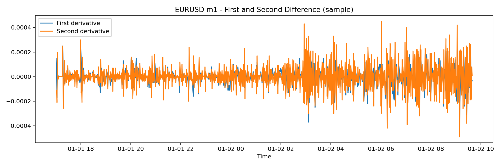

# 3. Derivate discrete: direzione, accelerazione, inversione

## Definizione pratica

Nel vault la derivata prima e la derivata seconda sono introdotte come versioni discrete e operative:

$$
dP_t = P_t - P_{t-1}
$$

$$
d^2P_t = dP_t - dP_{t-1}
$$

Nel linguaggio del progetto:
- $dP_t$ misura la direzione immediata;
- $d^2P_t$ misura la variazione della direzione, cioe' accelerazione o rallentamento.

## Interpretazione di mercato

| Segno | Lettura |
|---|---|
| $dP_t > 0$ | bias rialzista |
| $dP_t < 0$ | bias ribassista |
| $d^2P_t > 0$ | spinta crescente |
| $d^2P_t < 0$ | spinta che si indebolisce |

Una derivata prima positiva non basta: un trend puo' essere positivo ma perdere energia. La seconda derivata serve a distinguere:
- trend forte ma in estensione;
- trend forte ma in esaurimento;
- falsa partenza;
- inversione probabile.

## Uso nelle strategie

Le derivate sono un filtro di timing:
1. il contesto viene stimato da FFT o frattali;
2. la derivata prima conferma il verso;
3. la derivata seconda decide se entrare subito o attendere.

## Chart

## Collegamento con la fisica del prezzo

Il prezzo non viene trattato come segnale statico, ma come traiettoria:
- la prima differenza corrisponde alla velocita' discreta;
- la seconda differenza corrisponde all'accelerazione discreta;
- il cambio di segno della seconda differenza segnala un possibile punto di svolta.

## Regola utile

In presenza di rumore elevato, la derivata va sempre letta dopo un minimo di smoothing. Senza questo passaggio si amplifica il rumore invece del segnale.
