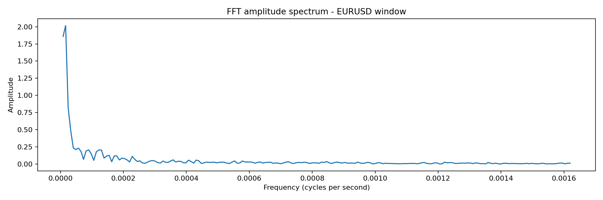
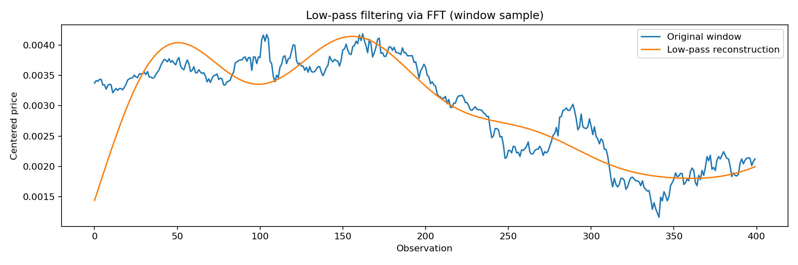

# 4. Fourier, FFT e lettura spettrale

## Idea centrale

Il prezzo puo' essere visto come somma di componenti periodiche e non periodiche. La trasformata di Fourier sposta l'attenzione:
- dal tempo alla frequenza;
- dalla forma visibile alla struttura nascosta;
- dal singolo movimento al ciclo dominante.

## Formula continua

$$
X(\omega) = \int_{-\infty}^{\infty} x(t)e^{-i\omega t}dt
$$

$$
x(t) = \frac{1}{2\pi} \int_{-\infty}^{\infty} X(\omega)e^{i\omega t}d\omega
$$

## DFT

Per una sequenza discreta di lunghezza $N$:

$$
X_k = \sum_{n=0}^{N-1} x_n e^{-i2\pi kn/N}
$$

$$
x_n = \frac{1}{N}\sum_{k=0}^{N-1} X_k e^{i2\pi kn/N}
$$

## Proprieta' che contano nel trading

| Proprieta' | Impatto operativo |
|---|---|
| linearita' | sommare filtri e segnali |
| simmetria | interpretazione delle frequenze positive/negative |
| convoluzione | filtraggio nel dominio del tempo |
| modulazione | traslazione di una banda di frequenza |
| Parseval | energia uguale in tempo e frequenza |
| differenziazione | enfasi sulle alte frequenze |
| time shifting | ritardo/fase del segnale |

## Parseval

$$
\sum_{n=0}^{N-1}|x_n|^2 = \frac{1}{N}\sum_{k=0}^{N-1}|X_k|^2
$$

Questa identita' e' utile per verificare che il filtraggio non distrugga energia in modo incoerente.

## Frequenze basse e alte

- frequenze basse: trend, cicli lenti, struttura di fondo;
- frequenze alte: micro-rumore, micro-variazione, spike.

Il trading quantitativo ha senso solo se il filtro conserva la banda utile e sopprime il resto senza introdurre eccessivo lag.

## Grafici dimostrativi

## Problemi classici

### Gibbs
Ai bordi di una discontinuita' la ricostruzione puo' oscillare. Questo non implica fallimento del metodo, ma richiede consapevolezza della convergenza.

### Aliasing
Se il campionamento e' troppo lento rispetto alla frequenza del segnale, le frequenze alte si ripiegano sulle basse. Nel trading significa confondere rumore rapido con ciclo reale.

### Scelta della finestra
La finestra e' sempre un compromesso tra:
- risoluzione in frequenza;
- reattivita' nel tempo;
- stabilita' del pattern.

## Lettura operativa

La FFT non deve essere usata come oracolo, ma come:
- localizzatore di ciclo;
- filtro di rumore;
- strumento per stimare la banda principale;
- base per regole di conferma.
