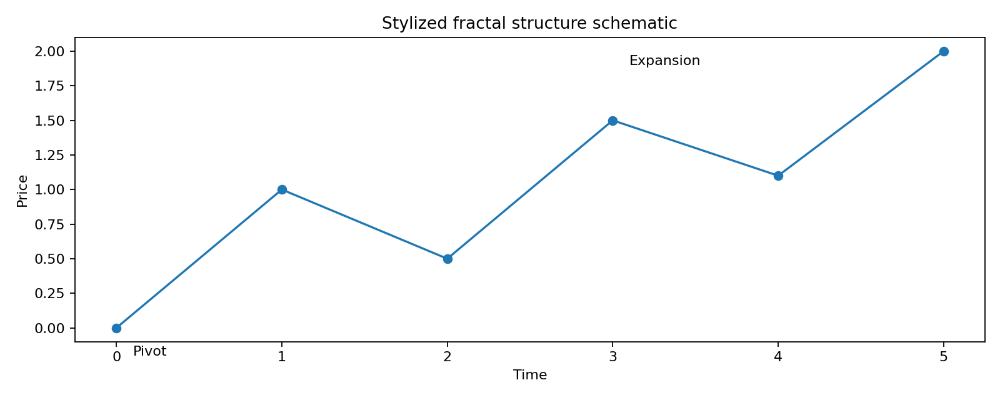

# 6. Frattali: libreria di pattern e traslazioni

## Cosa emerge dai materiali frattali

I PDF frattali mostrano una libreria di pattern LONG formata da sequenze di 3 fino a 6 candele, con estensioni successive fino a range piu' ampi nel vault. Il punto non e' solo riconoscere la forma, ma riconoscere:
- struttura;
- trasformazione;
- ricorrenza;
- posizione nel contesto.

## Unita' minima del pattern

Ogni pattern candidato dovrebbe essere descritto da:

| Campo | Significato |
|---|---|
| pattern_id | identificativo univoco |
| range_candele | ampiezza temporale della figura |
| pivot_count | numero di pivot principali |
| shape_vector | vettore descrittivo della forma |
| ampiezza_relativa | profondita' o ampiezza del movimento |
| durata_relativa | tempo impiegato |
| slope | pendenza complessiva |
| curvature | piegatura / variazione di pendenza |
| entry_zone | area di ingresso |
| target_zone | area target |
| invalidazione | livello che ne rompe la logica |

## Trasformazioni ammesse

Il materiale lascia intendere che la stessa identita' strutturale possa sopravvivere a trasformazioni diverse:
- traslazione temporale;
- traslazione verticale;
- scaling in ampiezza;
- scaling temporale;
- inversione;
- riflessione.

Questa idea e' utile per il matching dei pattern su asset diversi o su scale temporali diverse.

## Pattern da 3 a 6 candele

Nel PDF originale le sequenze sono presentate come tavole di pattern. Nel vault si traduce la libreria in una struttura operativa che consente:
- comparazione storica;
- similarita' geometrica;
- selezione di setup;
- studio di deformazioni del pattern.

## Fractal Circular Indicator

Il Circular Indicator viene interpretato come framework che unisce:
- pivot frattali;
- tempi ciclici;
- geometria circolare o ellittica;
- livelli armonici;
- zone di espansione e ritorno.

La parte importante per il trading non e' la forma estetica, ma l'ipotesi che la relazione tempo-prezzo abbia cicli ricorrenti e punti di simmetria utili al timing.

## Lettura operativa del frattale

1. individuare pivot;
2. misurare ampiezza e durata;
3. classificare la forma;
4. confrontarla con il catalogo storico;
5. attendere la conferma di volume, momentum o derivata;
6. entrare solo se il rischio e' definito.

## Limite metodologico

Il frattale non va trattato come verita' assoluta. Va trattato come:
- descrittore di forma;
- filtro di contesto;
- ipotesi da validare con backtest.
