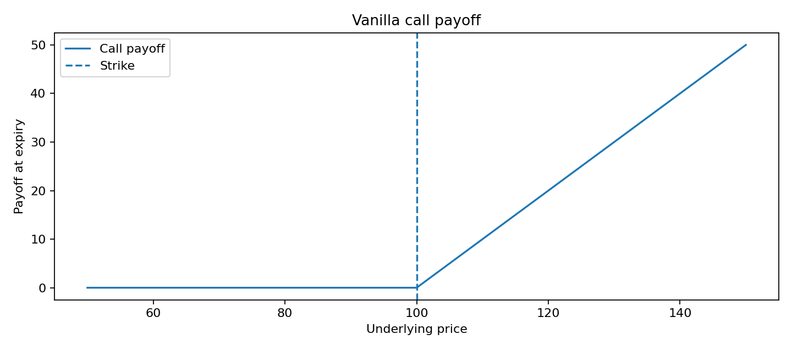

# 8. Fourier transform pricing, Black-Scholes, Merton e Variance Gamma

## Perche' Fourier nel pricing

Il libro di Matsuda mostra che il pricing via Fourier diventa utile quando il modello ha una caratteristica funzione nota, anche se la densita' di prezzo terminale non e' scrivibile in forma semplice.

Il vantaggio e':
- generalita';
- velocita' di calibrazione;
- compatibilita' con modelli a salto;
- uso diretto della characteristic function.

## Funzione caratteristica

$$
\phi_X(u) = E[e^{iuX}]
$$

Da questa si ottengono:
- momenti;
- cumulanti;
- pricing integrale.

## Black-Scholes

Nel caso classico, il prezzo di una call europea puo' essere espresso in forma chiusa. Nel linguaggio del compendio, Black-Scholes resta il caso base:
- solo diffusione continua;
- no salti;
- varianza lognormale.

## Merton jump-diffusion

Il modello Merton aggiunge salti casuali:
- numero di salti Poisson;
- ampiezza dei salti gaussiana o comunque parametrica;
- coda piu' realistica rispetto al solo Brownian motion.

Questo rende il modello piu' adatto ai mercati che presentano shock discreti.

## Variance Gamma

Il VG usa una subordinazione:
- tempo operativo casuale;
- code piu' pesanti;
- skewness e kurtosis piu' realistiche.

## Formula di pricing via Fourier

Una forma standard del prezzo call damped e':

$$
C(K) = \frac{e^{-rT-\alpha k}}{\pi} \int_0^\infty
\Re\left[
e^{-iuk}
\frac{\phi\left(u-(\alpha+1)i\right)}
{\alpha^2 + \alpha - u^2 + i(2\alpha+1)u}
\right]du
$$

dove:
- $k = \ln K$;
- $\alpha$ e' il parametro di damping;
- $\phi$ e' la characteristic function del log-prezzo terminale.

## DFT pricing

La DFT approssima l'integrale e permette calcolo rapido su una griglia di strike.

## Payoff call

## Uso nel progetto

Il blocco pricing non serve solo a prezzare opzioni, ma anche a insegnare come:
- usare la characteristic function;
- gestire distribuzioni non gaussiane;
- lavorare con dati in frequenza;
- mantenere il legame tra mercato e forma matematica del processo.

## Messaggio chiave

Se il mercato ha salti, asimmetria e code pesanti, un modello puramente gaussiano e' spesso insufficiente. La coppia Fourier + Lévy e' piu' coerente con la struttura osservabile.
