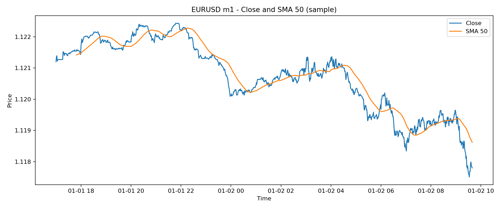

# Compendio tecnico del sistema trading ibrido

Questo documento integra i materiali PDF sorgente, le note del vault e gli esempi numerici su EURUSD.
La parte finale del PDF include il materiale originale in allegato, in modo da avere sia la lettura sintetica sia la traccia completa delle fonti.

## Criterio di costruzione
- teoria matematica prima;
- traduzione operativa subito dopo;
- validazione con dati reali;
- confronto continuo con backtest e metriche.

\newpage

# Mappa delle fonti e dei concetti estratti

Questo nodo raccoglie la traccia di provenienza dei materiali analizzati e la loro traduzione operativa nel vault.

| Fonte | Nucleo concettuale | Uso nel progetto |
|---|---|---|
| ECONSIGS.pdf | Wiener-Kolmogorov, filtri finiti, Butterworth digitale, processi band-limited | Filtri di estrazione segnale e lettura della struttura di frequenza |
| FIVESTAT.pdf | Fourier statistico, DFT, matrice circolante, aliasing, sampling, Parseval | Base teorica per FFT su dati finanziari e controllo della ricostruzione |
| Matsuda Intro FT Pricing.pdf | Fourier transform pricing, characteristic functions, DFT, Black-Scholes, Merton, VG | Ponte tra FFT e pricing di opzioni / modelli di salto |
| fractals.pdf | Libreria di pattern frattali LONG, sequenze da 3 a 6 candele | Pattern matching e catalogo operativo per ingressi e conferme |
| Pythagoras_Trading_Prediction_.pdf | Frattali, proiezione temporale, narrazione coscienza/mercato, Fourier, derivate | Traduzione delle idee frattali in ipotesi testabili e filtri di mercato |

## Regola di lettura
La parte teorica viene separata in tre livelli:

1. **Descrizione matematica**: formule, trasformate, densità, filtri, derivate.
2. **Operativita' di mercato**: entry, timing, conferme, uscita, rischio.
3. **Validazione**: backtest, out-of-sample, metriche, robustezza.

## Nota metodologica
Le componenti filosofiche o speculative presenti in alcuni materiali vengono mantenute come contesto storico o narrativo, ma nel progetto vengono convertite solo nelle parti osservabili e testabili:
- ricorrenza di forme
- trasformazioni invarianti
- cicli dominanti
- accelerazione/decelerazione del prezzo
- metriche verificabili

\newpage

# 1. Architettura del sistema ibrido

## Obiettivo generale

Il sistema non nasce come singolo indicatore, ma come catena di trasformazione:

**dati grezzi -> pulizia -> decomposizione -> pattern -> decisione -> esecuzione -> misurazione -> apprendimento**

Il principio di progetto e' conservare solo cio' che produce un vantaggio ripetibile. Il resto rimane ipotesi da testare.

## Strati del motore

| Strato | Funzione | Output |
|---|---|---|
| Data Layer | raccogliere OHLC, volumi, sessioni, spread, eventi | serie pulite e allineate |
| Transform Layer | applicare FFT, derivate, smoothing, filtri | segnali numerici e spettrali |
| Pattern Layer | riconoscere forme frattali, simmetrie, ricorrenze | pattern_id, confidenza, zona |
| Feature Layer | unire ampiezza, fase, pendenza, curvatura, volatilita' | feature vector |
| Decision Engine | combinare regole e filtri | long / short / no trade |
| Risk Layer | size, SL, TP, RR, max exposure | ordine controllato |
| Backtest Layer | misurare edge, robustezza, degrado | report e ranking |
| Logging Layer | memorizzare risultati e anomalie | memoria strutturata |

## Regole di progetto estratte dal vault

- testare un concetto per volta;
- validare prima in isolamento;
- accettare solo combinazioni che migliorano il risultato netto;
- usare risk contenuto;
- impedire che l'ottimizzazione distrugga la generalizzazione;
- non confondere spiegazione teorica e vantaggio operativo.

## Pipeline operativa

1. Normalizzazione dei dati.
2. Estrazione del segnale dominante.
3. Identificazione del contesto di mercato.
4. Verifica di timing con derivate.
5. Confluenza con pattern frattali.
6. Calcolo del rischio e della taglia.
7. Simulazione e logging.
8. Iterazione.

## Criterio di utilita'

Un modulo entra nel sistema finale solo se risponde a tre domande:

- riduce rumore?
- migliora timing o selezione?
- mantiene robustezza su piu' periodi?

Se la risposta e' no, il modulo resta in osservazione.

\newpage

# 2. Dati, pulizia e lettura del mercato

## Dataset reale usato come riferimento

Nel corpus e' presente una serie minute su EURUSD (`eurusd_m1_2020_2025_combined.csv`). Un estratto iniziale mostra struttura OHLC standard con volume nullo su molte barre forex interbank.

| Campo | Significato |
|---|---|
| datetime | timestamp della barra |
| open | apertura |
| high | massimo |
| low | minimo |
| close | chiusura |
| volume | volume registrato |

## Osservazioni preliminari sul campione analizzato

Su un campione iniziale di 100000 righe:
- media prezzo close circa 1.1016;
- deviazione standard del close circa 0.0157;
- deviazione standard dei rendimenti minuti circa 0.000178;
- skewness positiva;
- curtosi molto alta, quindi code grasse e outlier non trascurabili.

Questa combinazione indica che il mercato non si comporta come una gaussiana semplice e che il modello deve tollerare regime shift, spike e cluster di volatilita'.

## Pulizia minima necessaria

1. Ordinare per tempo.
2. Verificare duplicati.
3. Controllare buchi o barre anomale.
4. Uniformare timezone.
5. Separare training, validation e test.
6. Trattare i rendimenti come oggetto principale, non solo il prezzo.

## Perché il prezzo da solo non basta

Il prezzo e' una traiettoria cumulata. Per il trading quantitativo interessano anche:
- differenze discrete;
- log-return;
- volatilita' realizzata;
- range intrabar;
- continuita' o discontinuita' del regime.

## Chart di riferimento

## Lettura operativa

Il prezzo grezzo e' utile per visualizzare il contesto, ma il motore deve ragionare su:
- pendenza locale;
- curvatura;
- distanza da media;
- ampiezza del movimento;
- varianza recente;
- posizione rispetto a ciclo e pattern.

## Implicazione per il backtest

Un backtest corretto deve conservare il dato originale e, in parallelo, derivarne una vista feature-based. In pratica:
- OHLC per la simulazione;
- returns per il rischio;
- FFT per il ciclo;
- derivate per il timing;
- pattern per la direzione condizionata.

\newpage

# 3. Derivate discrete: direzione, accelerazione, inversione

## Definizione pratica

Nel vault la derivata prima e la derivata seconda sono introdotte come versioni discrete e operative:

$$
dP_t = P_t - P_{t-1}
$$

$$
d^2P_t = dP_t - dP_{t-1}
$$

Nel linguaggio del progetto:
- $dP_t$ misura la direzione immediata;
- $d^2P_t$ misura la variazione della direzione, cioe' accelerazione o rallentamento.

## Interpretazione di mercato

| Segno | Lettura |
|---|---|
| $dP_t > 0$ | bias rialzista |
| $dP_t < 0$ | bias ribassista |
| $d^2P_t > 0$ | spinta crescente |
| $d^2P_t < 0$ | spinta che si indebolisce |

Una derivata prima positiva non basta: un trend puo' essere positivo ma perdere energia. La seconda derivata serve a distinguere:
- trend forte ma in estensione;
- trend forte ma in esaurimento;
- falsa partenza;
- inversione probabile.

## Uso nelle strategie

Le derivate sono un filtro di timing:
1. il contesto viene stimato da FFT o frattali;
2. la derivata prima conferma il verso;
3. la derivata seconda decide se entrare subito o attendere.

## Chart

## Collegamento con la fisica del prezzo

Il prezzo non viene trattato come segnale statico, ma come traiettoria:
- la prima differenza corrisponde alla velocita' discreta;
- la seconda differenza corrisponde all'accelerazione discreta;
- il cambio di segno della seconda differenza segnala un possibile punto di svolta.

## Regola utile

In presenza di rumore elevato, la derivata va sempre letta dopo un minimo di smoothing. Senza questo passaggio si amplifica il rumore invece del segnale.

\newpage

# 4. Fourier, FFT e lettura spettrale

## Idea centrale

Il prezzo puo' essere visto come somma di componenti periodiche e non periodiche. La trasformata di Fourier sposta l'attenzione:
- dal tempo alla frequenza;
- dalla forma visibile alla struttura nascosta;
- dal singolo movimento al ciclo dominante.

## Formula continua

$$
X(\omega) = \int_{-\infty}^{\infty} x(t)e^{-i\omega t}dt
$$

$$
x(t) = \frac{1}{2\pi} \int_{-\infty}^{\infty} X(\omega)e^{i\omega t}d\omega
$$

## DFT

Per una sequenza discreta di lunghezza $N$:

$$
X_k = \sum_{n=0}^{N-1} x_n e^{-i2\pi kn/N}
$$

$$
x_n = \frac{1}{N}\sum_{k=0}^{N-1} X_k e^{i2\pi kn/N}
$$

## Proprieta' che contano nel trading

| Proprieta' | Impatto operativo |
|---|---|
| linearita' | sommare filtri e segnali |
| simmetria | interpretazione delle frequenze positive/negative |
| convoluzione | filtraggio nel dominio del tempo |
| modulazione | traslazione di una banda di frequenza |
| Parseval | energia uguale in tempo e frequenza |
| differenziazione | enfasi sulle alte frequenze |
| time shifting | ritardo/fase del segnale |

## Parseval

$$
\sum_{n=0}^{N-1}|x_n|^2 = \frac{1}{N}\sum_{k=0}^{N-1}|X_k|^2
$$

Questa identita' e' utile per verificare che il filtraggio non distrugga energia in modo incoerente.

## Frequenze basse e alte

- frequenze basse: trend, cicli lenti, struttura di fondo;
- frequenze alte: micro-rumore, micro-variazione, spike.

Il trading quantitativo ha senso solo se il filtro conserva la banda utile e sopprime il resto senza introdurre eccessivo lag.

## Grafici dimostrativi

## Problemi classici

### Gibbs
Ai bordi di una discontinuita' la ricostruzione puo' oscillare. Questo non implica fallimento del metodo, ma richiede consapevolezza della convergenza.

### Aliasing
Se il campionamento e' troppo lento rispetto alla frequenza del segnale, le frequenze alte si ripiegano sulle basse. Nel trading significa confondere rumore rapido con ciclo reale.

### Scelta della finestra
La finestra e' sempre un compromesso tra:
- risoluzione in frequenza;
- reattivita' nel tempo;
- stabilita' del pattern.

## Lettura operativa

La FFT non deve essere usata come oracolo, ma come:
- localizzatore di ciclo;
- filtro di rumore;
- strumento per stimare la banda principale;
- base per regole di conferma.

\newpage

# 5. Estrazione del segnale: Wiener-Kolmogorov, Butterworth e processi band-limited

## Nucleo concettuale

Il documento sulle signal extraction methods insiste su un'idea precisa: il segnale osservato e' una somma di componenti che si possono filtrare in modo ottimale se si conosce abbastanza della loro struttura statistica.

La forma classica e':

$$
y(t) = \xi(t) + \eta(t)
$$

dove:
- $\xi(t)$ = segnale;
- $\eta(t)$ = rumore.

## Estimatori di Wiener-Kolmogorov

Per serie finite, gli stimatori minimi in senso quadratico sono:

$$
\hat\xi = \Omega_\xi(\Omega_\xi + \Omega_\eta)^{-1}y
$$

$$
\hat\eta = \Omega_\eta(\Omega_\xi + \Omega_\eta)^{-1}y
$$

Queste formule esprimono l'idea di separare il dato in due parti che si spiegano reciprocamente.

## Filtri Butterworth

Il Butterworth digitale viene usato come prototipo di filtro con transizione regolare:

$$
|H(\omega)|^2 = \frac{1}{1 + (\omega/\omega_c)^{2n}}
$$

Dove:
- $\omega_c$ = frequenza di taglio;
- $n$ = ordine del filtro.

Un ordine maggiore produce una transizione piu' netta ma aumenta il rischio di eccesso di fase e instabilita' pratica.

## Band-limited processes

Il documento evidenzia che alcuni processi sono band-limited: la loro energia vive in bande separate da zone di silenzio spettrale. Per il progetto questo significa:
- non tutte le frequenze sono uguali;
- ci sono zone informative;
- il filtro deve rispettare la separazione tra bande.

## Forme operative nel trading

| Oggetto | Lettura |
|---|---|
| banda bassa | trend macro |
| banda media | swing e cicli intermedi |
| banda alta | microstruttura / rumore |
| dead space | intervallo di scarsa informazione |

## Confronto con Kalman

Il testo di Pollock sottolinea che il Kalman e' potente ma complesso. Nel progetto la lezione e':
- usare il minimo modello sufficiente;
- non complicare se il filtro locale basta;
- preferire una struttura testabile e spiegabile.

## Pipeline consigliata

1. filtro anti-rumore;
2. FFT per stimare la banda;
3. ricostruzione a banda limitata;
4. derivata del segnale filtrato;
5. decisione con regole di contesto;
6. backtest sul risultato.

## Chart di supporto

\newpage

# 6. Frattali: libreria di pattern e traslazioni

## Cosa emerge dai materiali frattali

I PDF frattali mostrano una libreria di pattern LONG formata da sequenze di 3 fino a 6 candele, con estensioni successive fino a range piu' ampi nel vault. Il punto non e' solo riconoscere la forma, ma riconoscere:
- struttura;
- trasformazione;
- ricorrenza;
- posizione nel contesto.

## Unita' minima del pattern

Ogni pattern candidato dovrebbe essere descritto da:

| Campo | Significato |
|---|---|
| pattern_id | identificativo univoco |
| range_candele | ampiezza temporale della figura |
| pivot_count | numero di pivot principali |
| shape_vector | vettore descrittivo della forma |
| ampiezza_relativa | profondita' o ampiezza del movimento |
| durata_relativa | tempo impiegato |
| slope | pendenza complessiva |
| curvature | piegatura / variazione di pendenza |
| entry_zone | area di ingresso |
| target_zone | area target |
| invalidazione | livello che ne rompe la logica |

## Trasformazioni ammesse

Il materiale lascia intendere che la stessa identita' strutturale possa sopravvivere a trasformazioni diverse:
- traslazione temporale;
- traslazione verticale;
- scaling in ampiezza;
- scaling temporale;
- inversione;
- riflessione.

Questa idea e' utile per il matching dei pattern su asset diversi o su scale temporali diverse.

## Pattern da 3 a 6 candele

Nel PDF originale le sequenze sono presentate come tavole di pattern. Nel vault si traduce la libreria in una struttura operativa che consente:
- comparazione storica;
- similarita' geometrica;
- selezione di setup;
- studio di deformazioni del pattern.

## Fractal Circular Indicator

Il Circular Indicator viene interpretato come framework che unisce:
- pivot frattali;
- tempi ciclici;
- geometria circolare o ellittica;
- livelli armonici;
- zone di espansione e ritorno.

La parte importante per il trading non e' la forma estetica, ma l'ipotesi che la relazione tempo-prezzo abbia cicli ricorrenti e punti di simmetria utili al timing.

## Lettura operativa del frattale

1. individuare pivot;
2. misurare ampiezza e durata;
3. classificare la forma;
4. confrontarla con il catalogo storico;
5. attendere la conferma di volume, momentum o derivata;
6. entrare solo se il rischio e' definito.

## Limite metodologico

Il frattale non va trattato come verita' assoluta. Va trattato come:
- descrittore di forma;
- filtro di contesto;
- ipotesi da validare con backtest.

\newpage

# 7. Analisi del documento Pythagoras e traduzione operativa

## Contenuto concettuale del PDF

Il documento Pythagoras intreccia:
- frattali;
- Fourier;
- derivate;
- idea di proiezione del futuro;
- narrazione su coscienza, osservatore e mercato.

La parte utile al progetto non e' la cornice filosofica in se, ma la catena di lavoro che suggerisce:

**frattale -> Fourier -> estrazione del ciclo -> timing -> decisione**

## Traduzione in ipotesi testabili

Dal punto di vista operativo, questa catena si puo' riscrivere cosi:

1. il mercato mostra forme ricorrenti;
2. tali forme hanno una componente ciclica;
3. la componente ciclica si puo' scomporre;
4. la scomposizione aiuta il timing;
5. il timing diventa regola di ingresso o uscita.

## Parti non trasferibili direttamente

Le sezioni su:
- magia;
- coscienza come causa fisica;
- lettura non locale del tempo;
- interpretazioni speculative dell'universo;

non vengono usate come ipotesi di trading. Rimangono come materiale narrativo del documento originario.

## Parti trasferibili

| Concetto | Traduzione nel vault |
|---|---|
| ricorrenza | pattern matching |
| simmetria | trasformazioni invarianti |
| proiezione temporale | stima di turning window |
| Fourier | decomposizione del prezzo |
| derivata | direzione e accelerazione |
| consapevolezza | in pratica = osservazione disciplinata e logging |

## Lezione metodologica

Il trader non deve cercare conferme ideologiche, ma:
- osservare;
- misurare;
- memorizzare;
- verificare;
- correggere.

## Uso nel progetto

Il documento viene quindi letto come:
- fonte di idee strutturali;
- contenitore di pattern e metafore;
- generatore di ipotesi di ricerca;
- non come prova matematica del sistema.

\newpage

# 8. Fourier transform pricing, Black-Scholes, Merton e Variance Gamma

## Perche' Fourier nel pricing

Il libro di Matsuda mostra che il pricing via Fourier diventa utile quando il modello ha una caratteristica funzione nota, anche se la densita' di prezzo terminale non e' scrivibile in forma semplice.

Il vantaggio e':
- generalita';
- velocita' di calibrazione;
- compatibilita' con modelli a salto;
- uso diretto della characteristic function.

## Funzione caratteristica

$$
\phi_X(u) = E[e^{iuX}]
$$

Da questa si ottengono:
- momenti;
- cumulanti;
- pricing integrale.

## Black-Scholes

Nel caso classico, il prezzo di una call europea puo' essere espresso in forma chiusa. Nel linguaggio del compendio, Black-Scholes resta il caso base:
- solo diffusione continua;
- no salti;
- varianza lognormale.

## Merton jump-diffusion

Il modello Merton aggiunge salti casuali:
- numero di salti Poisson;
- ampiezza dei salti gaussiana o comunque parametrica;
- coda piu' realistica rispetto al solo Brownian motion.

Questo rende il modello piu' adatto ai mercati che presentano shock discreti.

## Variance Gamma

Il VG usa una subordinazione:
- tempo operativo casuale;
- code piu' pesanti;
- skewness e kurtosis piu' realistiche.

## Formula di pricing via Fourier

Una forma standard del prezzo call damped e':

$$
C(K) = \frac{e^{-rT-\alpha k}}{\pi} \int_0^\infty
\Re\left[
e^{-iuk}
\frac{\phi\left(u-(\alpha+1)i\right)}
{\alpha^2 + \alpha - u^2 + i(2\alpha+1)u}
\right]du
$$

dove:
- $k = \ln K$;
- $\alpha$ e' il parametro di damping;
- $\phi$ e' la characteristic function del log-prezzo terminale.

## DFT pricing

La DFT approssima l'integrale e permette calcolo rapido su una griglia di strike.

## Payoff call

## Uso nel progetto

Il blocco pricing non serve solo a prezzare opzioni, ma anche a insegnare come:
- usare la characteristic function;
- gestire distribuzioni non gaussiane;
- lavorare con dati in frequenza;
- mantenere il legame tra mercato e forma matematica del processo.

## Messaggio chiave

Se il mercato ha salti, asimmetria e code pesanti, un modello puramente gaussiano e' spesso insufficiente. La coppia Fourier + Lévy e' piu' coerente con la struttura osservabile.

\newpage

# 9. Metriche, rischio e validazione

## Metriche di base

| Metricas | Formula sintetica | Uso |
|---|---|---|
| Return | $(V_t - V_{t-1})/V_{t-1}$ | performance semplice |
| Log-return | $\ln(V_t/V_{t-1})$ | additivita' |
| Win rate | trade vincenti / trade totali | frequenza |
| Sharpe | media eccedenza / deviazione standard | efficienza rischio |
| Max drawdown | picco meno valle successiva | peggior perdita |
| Profit factor | gross profit / gross loss | bilancio del sistema |
| Expectancy | $p\cdot win - (1-p)\cdot loss$ | valore atteso |

## Drawdown

Il drawdown e' la metrica che piu' penalizza i sistemi fragili. Un sistema puo' avere buon win rate e fallire comunque per:
- perdite rare ma enormi;
- sequenze di trade avversi;
- leva eccessiva;
- assenza di stop coerenti.

## Validazione corretta

1. In-sample: costruzione.
2. Out-of-sample: verifica su dati non visti.
3. Walk-forward: stabilita' nel tempo.
4. Stress test: slippage, spread, shock, dati mancanti.
5. Regime test: trend, range, volatilita' alta, volatilita' bassa.

## Regola di sopravvivenza

Il motore non deve cercare solo il massimo profitto teorico, ma:
- drawdown accettabile;
- stabilita' temporale;
- assenza di overfitting;
- relazione chiara tra entry e rischio.

## Lettura operativa

Un sistema puo' essere considerato utile solo se i risultati rimangono leggibili su:
- periodi diversi;
- asset diversi;
- timeframe diversi;
- condizioni di mercato differenti.

## Collegamento con il dataset

Il dataset EURUSD minute e' adatto a:
- test di trend;
- test di micro-struttura;
- ricerca di cicli;
- confronto tra filtraggio e rumore.

\newpage

# 10. Decision engine e logica del bot

## Obiettivo del decisore

Il decisore non deve essere creativo in senso libero. Deve essere disciplinato, cioe' capace di combinare:
- contesto;
- timing;
- rischio;
- conferma;
- invalidazione.

## Sequenza logica

1. Il mercato e' in trend o in range?
2. Esiste un ciclo dominante?
3. La derivata conferma il verso?
4. Il pattern frattale e' valido?
5. Il rischio e' compatibile con la struttura?
6. L'entry ha un rapporto rischio/rendimento accettabile?
7. Il trade e' ripetibile in backtest?

## Esempio di regola combinata

- se FFT indica banda bassa dominante,
- e la pendenza locale e' positiva,
- e il pattern frattale mostra compressione seguita da breakout,
- allora la strategia puo' passare da osservazione a esecuzione.

## Moduli attualmente presenti nel vault

- MA crossover testato;
- derivata prima e seconda;
- idee FFT trend following;
- confluence frattale-circolare;
- proiezione pattern frattale-FFT;
- risk management;
- broker API;
- dashboard;
- experiment protocol.

## Principio di progetto

Il sistema finale deve rifiutare l'azione quando:
- il segnale e' ambiguo;
- il rumore e' troppo alto;
- il pattern non e' confermato;
- il rischio supera la soglia;
- il regime non e' adatto.

## Logica di memoria

Ogni esperimento deve produrre:
- input;
- ipotesi;
- parametri;
- risultato;
- motivo di successo o fallimento;
- decisione successiva.

Questo e' il meccanismo che trasforma la ricerca in un sistema cumulativo invece che in una sequenza di test isolati.

\newpage

# 11. Compendio formule essenziali

## Differenze discrete

$$
dP_t = P_t - P_{t-1}
$$

$$
d^2P_t = dP_t - dP_{t-1}
$$

## FFT / IFFT

$$
X_k = \sum_{n=0}^{N-1} x_n e^{-i2\pi kn/N}
$$

$$
x_n = \frac{1}{N}\sum_{k=0}^{N-1} X_k e^{i2\pi kn/N}
$$

## Fourier continua

$$
X(\omega) = \int_{-\infty}^{\infty} x(t)e^{-i\omega t}dt
$$

$$
x(t) = \frac{1}{2\pi}\int_{-\infty}^{\infty} X(\omega)e^{i\omega t}d\omega
$$

## Convoluzione

$$
(x * h)(t) = \int_{-\infty}^{\infty} x(\tau)h(t-\tau)d\tau
$$

## Parseval

$$
\int |x(t)|^2 dt = \frac{1}{2\pi} \int |X(\omega)|^2 d\omega
$$

## Funzione caratteristica

$$
\phi_X(u) = E[e^{iuX}]
$$

## Black-Scholes call

$$
C = S_0N(d_1) - Ke^{-rT}N(d_2)
$$

$$
d_1 = \frac{\ln(S_0/K) + (r + \frac{1}{2}\sigma^2)T}{\sigma\sqrt{T}}
$$

$$
d_2 = d_1 - \sigma\sqrt{T}
$$

## Butterworth

$$
|H(\omega)|^2 = \frac{1}{1 + (\omega/\omega_c)^{2n}}
$$

## Wiener-Kolmogorov

$$
\hat\xi = \Omega_\xi(\Omega_\xi + \Omega_\eta)^{-1}y
$$

$$
\hat\eta = \Omega_\eta(\Omega_\xi + \Omega_\eta)^{-1}y
$$

## Drawdown

$$
DD_t = \frac{\max_{s\le t}V_s - V_t}{\max_{s\le t}V_s}
$$

## Sharpe semplificato

$$
Sharpe = \frac{\overline{r-r_f}}{\sigma(r-r_f)}
$$

## Expectancy

$$
E = p\cdot \overline{win} - (1-p)\cdot \overline{loss}
$$

\newpage

# 12. Glossario operativo

- **Aliasing**: piegatura delle alte frequenze su bande piu' basse quando il campionamento e' insufficiente.
- **Ampiezza**: intensita' di una componente spettrale o di una oscillazione.
- **Band-limited**: processo con energia concentrata in una o piu' bande limitate.
- **Butterworth**: filtro con risposta monotona e transizione controllata.
- **Characteristic function**: trasformata complessa della distribuzione.
- **Curvatura**: misura della variazione della pendenza.
- **Cutoff**: frequenza di taglio di un filtro.
- **DFT**: trasformata discreta di Fourier.
- **Dead space**: zona spettrale di bassa o nulla energia.
- **Drawdown**: discesa dal massimo al valore corrente.
- **FFT**: algoritmo veloce per calcolare la DFT.
- **Frattale**: forma che conserva identita' sotto trasformazioni di scala o ripetizione.
- **IFFT**: trasformata inversa discreta.
- **Lag**: ritardo introdotto da un filtro.
- **Lévy process**: processo con incrementi indipendenti e stazionari.
- **Low-pass**: filtro che conserva le frequenze basse.
- **Momentum**: intensita' e continuita' del movimento.
- **Nyquist**: frequenza minima di campionamento per evitare aliasing.
- **Parseval**: uguaglianza dell'energia tra dominio del tempo e della frequenza.
- **Phase**: informazione di traslazione temporale.
- **Pivot**: punto di svolta locale nel prezzo.
- **Reconstruction**: ricostruzione del segnale filtrato.
- **Risk management**: controllo di perdita, leva e esposizione.
- **Sharpe ratio**: misura di rendimento corretto per il rischio.
- **Spectral density**: distribuzione dell'energia sulle frequenze.
- **Subordination**: composizione di processi con un tempo casuale.
- **Wiener-Kolmogorov**: formulazione ottimale per l'estrazione del segnale.

\newpage
